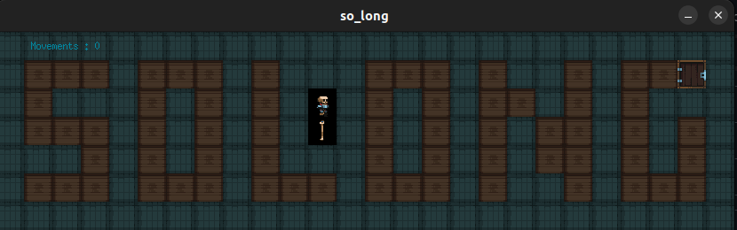
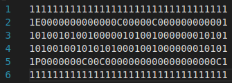
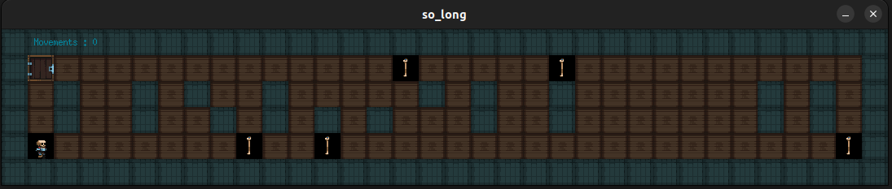
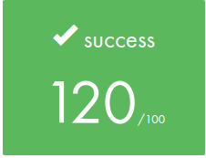
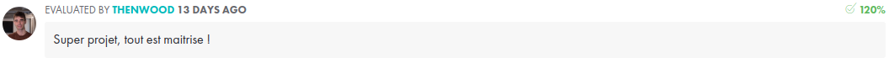
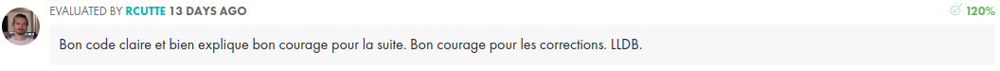
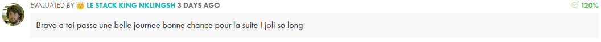

   
<p align="center">
	Ce projet t'a aidé ? Mets-lui une 🌟!

# So_Long 🎮

Le cinquième projet de l'école de programmation 42. C'est le premier projet graphique du cursus, nous pouvons choisir entre 3 options - FdF, Fractol et So_long - qui couvrent en général des domaines différents, mais tous les 3 sont des projets graphiques. Le so_long consiste en un jeu top-down, que nous codons à partir de zéro en utilisant la bibliothèque graphique MiniLibx. Il comprend une série de validations à partir de la carte qui est passée en argument, des contrôles pour éviter les fuites de mémoire, l'ingénierie du jeu, la gestion des fenêtres, des événements, des sprites et des cartes.
Vous pouvez trouver le sujet [ici](en.subject.pdf).


# Télécharge et joue ⬇️

Clone le projet.

```
git clone https://github.com/ugozchi/42_So_Long.git
cd 42_So_Long
```

<br>

## Options possibles ⚙️

Ici, vous pouvez utiliser les options classiques d'un Makefile (options ci-dessous) mais aussi l'option bonus qui vous permettra d'ajouter vos fonctions bonus dans votre fichier archive libft.a si vous les avez fait.  
Toute cette partie correspond à ce que l'on doit rendre pour ce faire corriger.

<br>

| Option | Description |
| --- | --- |
| `make` | Créer un fichier archive libftpritnf.a avec tous les fichiers |
| `make clean` | Supprime le dossier contenant les fichiers objets ```.o```|
| `make fclean` | Execute `clean` puis supprime le fichier archive ```.a```|
| `make re` | Execute `fclean` puis `make` |

<br>

Pour commencer à jouer lancer la commande :
```
	./so_long asstes/maps/valid/"select a map"
```

<br>

# Maps 🗺️

Vous pouvez analyser n'importe quel type de carte, à condition qu'elle respecte les règles ci-dessous :
- La carte doit être un fichier .ber.
- La carte ne doit contenri que ces caractères :

| CHAR |	OBJECT   |
| --------- | ---------- |
| 1         |   Wall   |
| C	        | Coin |
| E	        |   Exit  |
| P         |   Player  |      
| 0         |   Floor     |

- La map doit être entouré par des murs '1'
- Un chemin vers la sortie 'E' doit exister et tous les coins doivent être atteignables.

Regarder quelques exemples dans le dossier /assets/maps.

Voici l'une d'entre elle : assets/maps/valid/map3.ber



Ce fichier .ber génère cette map :



<br>

# Contrôle 🕹️

    
| KEY |	OBJECT   |
| --------- | ---------- |
| W or ⬆️        |    Monte   |
| A	or ⬅️        |    Gauche |
| S	or ⬇️     |    Descend   |
| D or ➡️       |   Droit|      
| Q or Esc      |   Quitte     | 
    
    
Utilisez WASD ou les flèchees directionnelles pour vous déplacer.
	
Après avoir récupéré tous les os, la sortie s'ouvre et vous pouvez vous échapper en bas.
	
Vous pouvez fermer le jeu en cliquant sur la croix rouge sur le cadre de la fenêtre, ou en appuyant sur Q ou Echap.	

## Note Final et Commentaires 📔

<br>

| |
| --- |
|  |


| | |
| --- | --- |
| Correcteur 1 |  |
| Correcteur 2 |  |
| Correcteur 3 |  |
